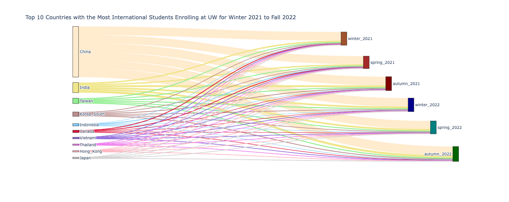
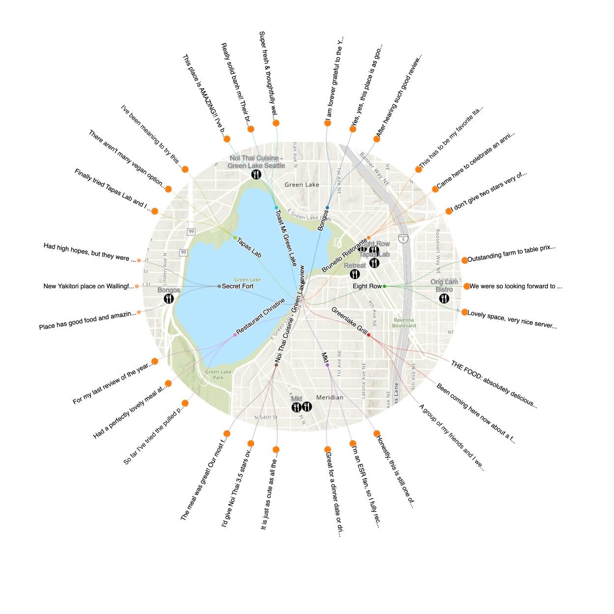
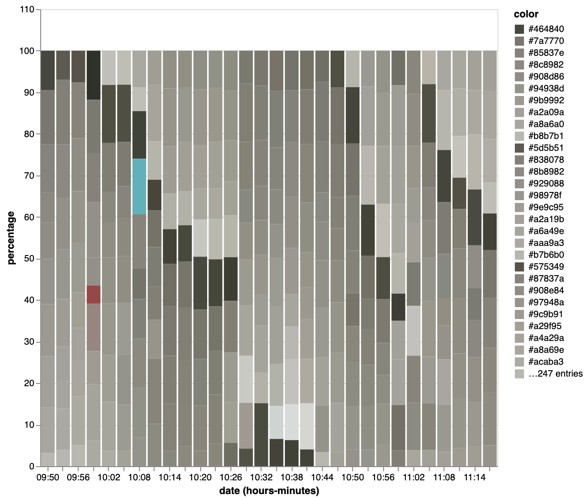
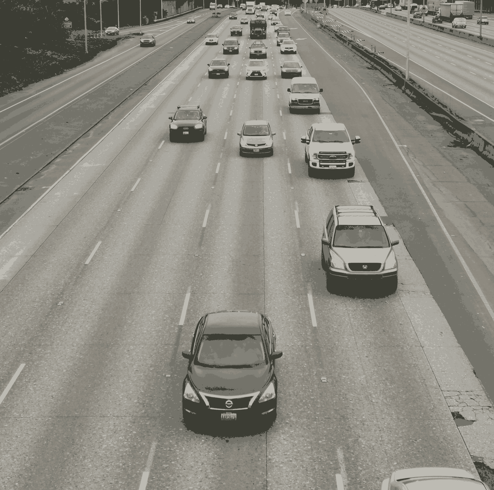
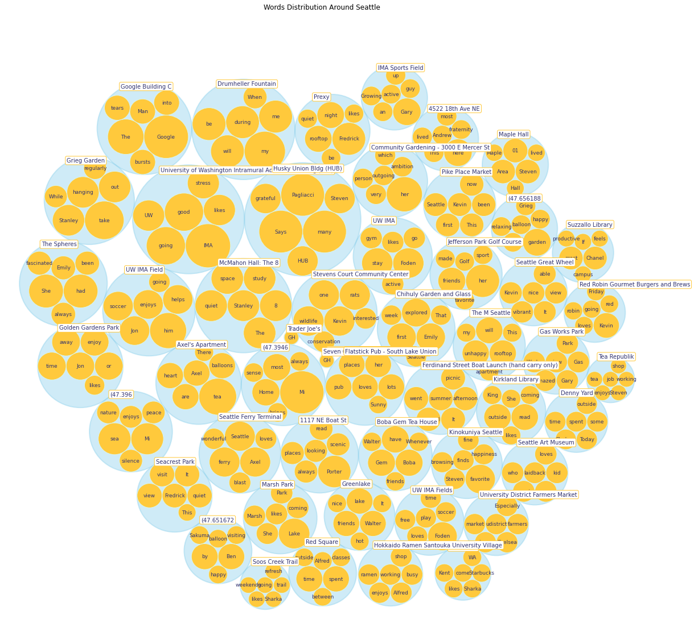

# <b>GEOG 495 Visualizing Seattle</b>
<p>
Author: Tianhao Yao
Instructor: Professor Gunwha Oh
</p>
<br>


# Lab 1

In lab 1, our task is to map the flow within Seattle. Our group decided to map the flow of international student attending UW from winter 2021 to autumn 2022.



Looking at the graph, we can see that China and India composed majority of the international students. Regarding the overall population, the pandic did affect the student attending UW between 2020 to 2022.

We have used plotly to generate the flow chart.

```python
import plotly.graph_objects as go

fig = go.Figure(data=[go.Sankey(
    node = dict(
      pad = 15,
      thickness = 15,
      line = dict(color = "black", width = 0.5),
      label = label,
      color = node_color,
    ),    
    link = dict(
      source = source,
      target = target,
      value = value,
      color = colors,
      hovertemplate='%{source.label} has total %{value} students during %{target.label}<extra></extra>',
  ))])

```
<br>

# Lab 2

In lab 2, our group decided to study what people enjoy doing and sharing their experience at Greenlake Seattle. We choce the topic of Restaurant.



We randomly selected 10 restaurants at Greenlake and extracted customer reviews from Yelp API. The dot size represent their review value. Majority of the reviews are scored 4.5 or higher. 

Here is an exmaple of the JSON data formate that we extracted. 

```json
{"name": "review", 
"children": 
    [{"name": "Bongos", "latitude": 47.6767449533551, "longitude": -122.346925400198, 
    "children": 
        [{"value": 4.5, "name": "I am forever grateful to the Yelp community for helping us find this spot. It must feel like an echochamber of positive reviews for newcomers but this place..."}, 
        {"value": 4.5, "name": "Yes, yes, this place is as good as everyone says. Trust me, I've come here 3x and it was randomly closed...and I still came back to try it...and then came..."}, 
        {"value": 4.5, "name": "After hearing such good reviews I was pleasantly surprised that this food lives up to its reputation. The veggie platter was particularly amazing for..."}]}]}
```

# Lab 3

In lab three, our group visualized the traffic condition recorded from the I-5 southbound on Feb 9th, 2023. We extracted top 10 dominant color from 30 images taken at the 50th st. intersecting the I-5 south high way. The dark color represent the color extracted from the vehicle. The light gray color represent the road. With the percentage comparison, we can visualize the change in traffic flow.



Here is an example of the processed image with Pillow library in Python




# Lab 4

Lab four provides insights into the happy life characteristics of Seattle. The fictional characters visited different places in Seattle, and the majority of them felt happy and positive about their experiences. Among these locations, UW IMA was the most frequently visited, and all of the characters felt positive when they visited.



Here is an example of processed JSON data extract from Padlet where dataum represent the number of total word count. 

```json
{"id": "Community Gardening - 3000 E Mercer St", 
"datum": 27.0, 
"children": 
    [{"id": "her", "datum": 3.0}, 
    {"id": "very", "datum": 1.0}, 
    {"id": "outgoing", "datum": 1.0}, 
    {"id": "ambition", "datum": 1.0}, 
    {"id": "person", "datum": 1.0}, 
    {"id": "which", "datum": 1.0}
    ]
} 
```
